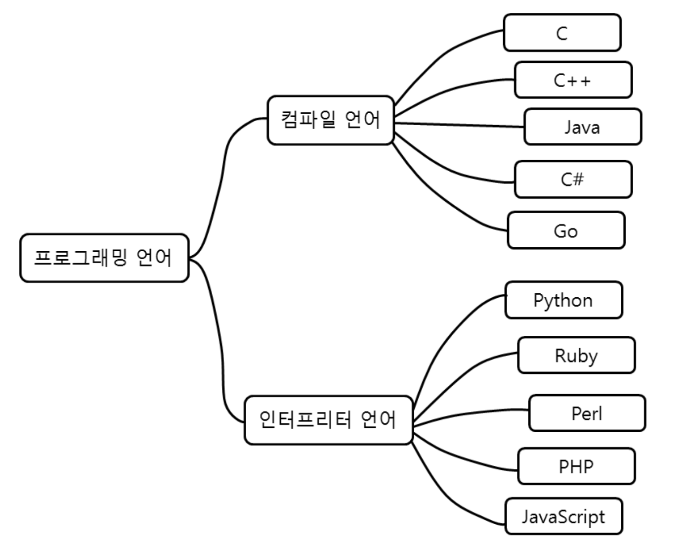

# MVP와 PoC, Prototype, Pilot 차이

## MVP와 PoC, Prototype, Pilot 차이 

Agile, Lean Startup의 MVP(최소 실행가능 제품, Minimum Viable Product를 이해하기 위해 PoC(개념증명), Prototype(프로토타입), Pilot(시범적용)과 비교해보겠습니다. 이들 모두는 검증이라는 공통점이 있습니다. 특히 MVP는 제품을 완전히 개발하지 않고도 제품에 대한 고객의 관심을 초기에 이해하고 개선/검증합니다. 따라서 고객의 반응에 따라 방향성을 개선 할 수 있으며, 시장에서 성공하지 못할 제품에 대한 시간, 노력, 비용을 줄일 수 있습니다.\

<figure><figcaption></figcaption></figure>

## 1. 설명 

### PoC(개념 증명, Proof of Concept) 

**개념 증명**(POC, Proof of Concept)은 (기존 시장에 없었던) **신기술을 도입하기 전에 이를 검증하기 위해 사용**한다. 특정 방식이나 아이디어를 실체화하여 타당성을 증명하는 것을 의미한다.

* 의미 : 새로 도입되는 기술이나 제품이 도입 목적에 부합되는지 검증
* 검증 : 그 기술이 생각한대로 동작 돼? 도입해도 돼?
* MVP와 차이점 : 실사용자인 고객이 사용/피드백 안함

### Prototype(프로토타입) 

**프로토타입**(prototype)은 시제품이 나오기 전의 제품의 원형이며, 개발검증과 양산 검증을 거쳐야 시제품이 될 수 있다. **프로토타입은 정보시스템의 미완성 버전 또는 중요한 기능들이 포함되어 있는 시스템의 초기모델**이다.

프로토타입은 사용자의 모든 요구사항이 정확하게 반영할 때까지 계속해서 개선/보완 된다. 실제로 많은 애플리케이션들이 지속적인 프로토타입의 확장과 보강을 통해 최종 승인되고 개발에 들어간다.

* 의미 : 시스템이나 제품들의 중요한 기능들이 포함된 초기모델(SW 개발 착수전 검증/승인)
* 검증 : 이렇게 설계하여 개발/양산(생산)해도 돼?
* MVP와 차이점 : 실사용자인 고객이 사용/피드백 안할 수도 있음

### Pilot (시범 적용) 

Pilot은 전체 확대 적용하기전에 소규모로 테스트해서 추후 발생할 수 있는 여러 문제의 원인을 미리 파악하고 수정 보완하기 위해 모의로 시행해 보는 활동입니다. 종종 새로운 공공 정책 또는 서비스 출시 전 사용됩니다.

* 의미 : 새로운 정책 또는 서비스 확산의 첫 번째 시범 적용
* 검증 : 더 넓은 그룹으로 확장해서 적용해도 돼?
* MVP와 차이점 : 실사용자인 고객이 사용/피드백은 유사하나 성공 또는 실패를 확인하기 위해 사용하며 지속적으로 검증하며 사용하지는 않음

### MVP(최소 실행가능 제품, Minimum Viable Product) 

**최소 실행 가능 제품**(Minimum Viable Product, MVP)은 고객에게 가치를 제공해야 하며, 고객 피드백을 받아 **생존하기 위한** 최소한의 노력을 들여 만든 기능(features)을 구현한 제품이다. 최소 실행 가능 제품(MVP)은 신제품 개발에서 학습의 영향을 강조하는 Lean Startup의 개념이다.

<figure><figcaption></figcaption></figure>

Eric Ries는 MVP를 [최소한의 노력으로 고객에 대한 검증 된 정보를 최대한 수집 할 수있는 새로운 제품 버전](http://www.startuplessonslearned.com/2009/08/minimum-viable-product-guide.html)으로 정의했다. 사람들이 제품과 관련하여 실제로 무엇을하는지 보는 것이 사람들에게 무엇을 원하는지 묻는 것보다 훨씬 더 신뢰할 수 있다.

* 의미 : 출시 후 제품이 생존하기 위해 최소한의 노력(개발범위, 시간)으로 고객에 대한 검증 된 정보를 최대한 수집 할 수있는 제품 버전
* 검증 : 고객에게 Value를 주는가? 고객이 원하는 것이 맞아? 가설대로 고객이 변화 돼?
* PoC, Prototype과 차이점 : 실사용자인 고객이 사용/피드백 해야 함
* Pilot과 차이점 : 성공/실패 확인 보다는 지속적인 실험/개선 목적
* MVP는 최소한의 노력으로 고객에게 Value를 주며 가설을 검증하며 개선

## 2. MVP에 대한 부연 설명 

MVP의 주요 이점은 제품을 완전한 전체를 개발하지 않고도 제품에 대한 고객의 관심을 이해하고 제품에 대한 의사결정을 할 수 있습니다. 따라서 시장에서 성공하지 못할 제품에 대한 노력, 시간, 비용이 줄어 듭니다. (극단적으로는 10억으로 망할 Product를 5억만 쓰고 망할 수 있습니다.)

또한 PoC나 Prototype은 일부 버그나 완성도가 낮을 수도 있지만, MVP는 시장에 출시 및 고객 검증 받을 수 있는 수준의 완성도는 필요합니다. 즉 전체 기능 완성이 아닌 품질은 완성되어야 합니다. (만약 정상 동작하지 않는 홈쇼핑 상품을 본다면 개선을 기대하고 구매하겠습니까?)

개인적으로 [Dropbox의 MVP(영상)](https://youtu.be/xy9nSnalvPc)는 최소라는 목적에는 부합되지만 실제 존재하지 않는 광고 수준의 [베이퍼웨어](https://ko.wikipedia.org/wiki/%EB%B2%A0%EC%9D%B4%ED%8D%BC%EC%9B%A8%EC%96%B4)이므로 일반적 MVP 예에서는 논외라고 생각됩니다.

결론적으로, 4가지 모두 검증이라는 공통점은 있지만, 단순한 업무 결과물(Output)을 넘어 MVP가 좀 더우리의 가설대로 고객이 실제 그렇게 변화되는지 성과(Outcome) 검증에 더 효과적이라고 생각됩니다.

<figure><figcaption></figcaption></figure>

## 3. 접근 방식의 예 

### 3.1. MVP 

절대로 자동차를 만들기위해 킥보드, 자전거, 오토바이, 자동차를 순차적으로 만들라는 의미가 아닙니다. MVP는 고객의 피드백을 받아 **생존하기 위한** 최소한의 기능(features)을 구현한 제품입니다. 특히 아래 그림은 동작(실제 사용해 볼 수 있는)되는 결과물을 강조한 것입니다.

<figure><figcaption></figcaption></figure>

Like this의 MVP Approach는 “사용자가 효율적으로 이동 할 수 있는 Value를 제공”하기 위한 과정을 소개하고 있습니다. MVP는 고객에게 실현(실행) 가능한 Value를 지속적으로 제공하기 위한 가설/검증하며 제품을 만들어 나갑니다.(부연 : 강의때 아래 그림만 보면 오해하시는분들이 많습니다. 고객에게 이동 편의성 같은 가치를 줘야 한다는 의미입니다.)

* 가설/검증1 : 바퀴가 있으면 사용자에게 Value를 제공할 것이다.
* 가설/검증2 : 손잡이가 있으면 사용자에게 더 큰 Value를 제공할 것이다.
* 가설/검증3 : 바퀴가 크면 사용자에게 더 큰 Value를 제공할 것이다.
* 가설/검증4 : 모터가 있으면 사용자에게 더 큰 Value를 제공할 것이다.
* 가설/검증5 : 바퀴가 4개면 사용자에게 더 큰 Value를 제공할 것이다.

물론 집에서 가까운 지하철역까지 이동하기 위해서는 자동차보다 공유 킥보드나 자전거가 더 큰 Value를 줄 수도 있습니다. 이 처럼 상황에 따라서 전략과 Outcome이 달라질 수 있습니다.

### 3.2. 다른 용어들 

* 모터를 킥보드에 탑재해서 전동 킥보드가 되는지 PoC해보겠습니다.
* 이것이 우리 전동킥보드의 Prototype입니다.
* 이 지역에 우리 공유 전동 킥보드가 효율적일지 Pilot 적용하겠습니다.
* 우리의 가설(전동 킥보드에 추가 feature)이 실제 사용자의 Needs를 충족하는지 반복적으로 실험, 검증하며 개선하겠습니다.

## 4. MVP 용어를 잘못 사용하는 경우 

최근에 MVP라는 용어를 주변에서 많이 사용 하지만, 내부 데모용 초기 버전을 MVP로 칭하는 경우가 있습니다.

### 4.1. 순차적 오픈 

서브 시스템 10개중 우선 4개를 1단계 프로젝트로 개발하고 우선 오픈하는 순차적 오픈을 MVP라고 부르기\
(부연 : 프로젝트 계획서에는 1단계 프로젝트 종료 후 개선없이 바로 2단계 프로젝트 시작)

* 사용자에게 검증/개선하기 위해 4개를 먼저 개발/오픈했다면 MVP가 맞음
* 만약, 4개를 오픈하고 검증/개선 계획 없이 바로 나머지를 개발한다면 MVP가 아닌 순차적 오픈임
* 즉, 원래 일정대로 가는 과정일 뿐 가설을 검증/개선하기 위한 목적이 아님

### 4.2. 베타 버전 

아직은 시장에 출시할 수준이 되지 않은 초기 버전을 MVP라고 부르기\
(부연:알파,베타, 사용성 테스트처럼 출시전 문제확인을 위한 테스트 목적임)

* 검증 목적으로 기능/컨셉을 시장에 출시하여 사용자의 Feedback을 받기 위한 목적이라면 MVP가 맞음
* 만약, 제품이 출시되기 전에 “내부인”이 아닌 “외부인”에게 정식 배포전에 테스트와 오류 수정을 위한 버전이라면 베타 버전임
* 즉, 가설을 검증하는 목적보다는 출시전 품질을 높이는 용도

### 4.3. Demo용 

막연하게 제3자에게 보여주기 위한 용도를 MVP라고 부르기

* PoC, Prototype, Pilot, MVP 모두 제3자에게 demo 할 수 있음

### 참고자료 

* PoC : [https://ko.wikipedia.org/wiki/%EA%B0%9C%EB%85%90\_%EC%A6%9D%EB%AA%85](https://ko.wikipedia.org/wiki/%EA%B0%9C%EB%85%90\_%EC%A6%9D%EB%AA%85)
* Prototype :\
  [https://ko.wikipedia.org/wiki/%ED%94%84%EB%A1%9C%ED%86%A0%ED%83%80%EC%9E%85](https://ko.wikipedia.org/wiki/%ED%94%84%EB%A1%9C%ED%86%A0%ED%83%80%EC%9E%85)
* MVP :\
  [https://www.startuplessonslearned.com/2009/08/minimum-viable-product-guide.html](https://www.startuplessonslearned.com/2009/08/minimum-viable-product-guide.html)
* Vaporware(**베이퍼웨어)** :\
  [https://ko.wikipedia.org/wiki/%EB%B2%A0%EC%9D%B4%ED%8D%BC%EC%9B%A8%EC%96%B4](https://ko.wikipedia.org/wiki/%EB%B2%A0%EC%9D%B4%ED%8D%BC%EC%9B%A8%EC%96%B4)
* Dropbox의 MVP 동영상(실제 제품은 없고 컨셉으로 증명 후 투자 받음)


What is Dropbox?



원문링크 : [https://medium.com/dtevangelist/mvp%EC%99%80-poc-prototype-pilot-%EC%B0%A8%EC%9D%B4-1f525cc4a218](https://medium.com/dtevangelist/mvp%EC%99%80-poc-prototype-pilot-%EC%B0%A8%EC%9D%B4-1f525cc4a218)

